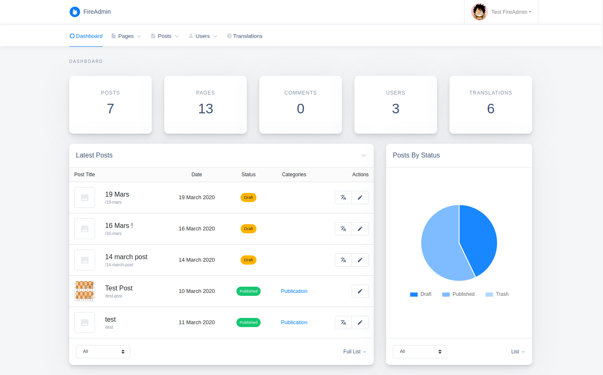

# FireAdmin

[](https://www.npmjs.com/package/ng-fire-admin)
[](https://www.npmjs.com/package/ng-fire-admin)
[](LICENSE)

A minimalistic headless CMS around Angular & Firebase.



## Demo

[FireAdmin Demo](https://axel-dev.github.io/FireAdmin/admin/login?email=guest@fireadmin.com&password=fireadmin)

## Features

- Simple & minimalistic
- Customizable
- Responsive
- Internationalization ready
- Easy/automated updates (via npm)

## ToDo

- [ ] Menus handler
- [ ] Password reset feature
- [ ] Posts comments
- [ ] Posts custom fields

## Installation

```
npm install --save ng-fire-admin
```

## Usage

> It's recommended to use a [multi-project workspace](https://angular.io/guide/file-structure#multiple-projects) with basically 2 main applications (one named frontend & the other backend, or whatever you like) to avoid any potential conflicts, then apply the following on your backend app:

**1**. Add your firebase configuration in `environment.ts`:

```diff
  export const environment = {
    production: false,
+   firebase: {
+     apiKey: "<API_KEY>",
+     authDomain: "<PROJECT_ID>.firebaseapp.com",
+     databaseURL: "https://<DATABASE_NAME>.firebaseio.com",
+     projectId: "<PROJECT_ID>",
+     storageBucket: "<BUCKET>.appspot.com",
+     messagingSenderId: "<SENDER_ID>",
+     appId: "<APP_ID>"
+   }
  };
```

**2**. Register the `FireAdminModule` in a module, for example app module:

```diff
  import { BrowserModule } from '@angular/platform-browser';
  import { NgModule } from '@angular/core';

  import { AppComponent } from './app.component';
+ import { FireAdminModule } from 'ng-fire-admin';
+ import { environment } from '../environments/environment';

  @NgModule({
    declarations: [AppComponent],
    imports: [
      BrowserModule,
+     FireAdminModule.initialize(environment.firebase)
    ],
    providers: [],
    bootstrap: [AppComponent]
  })
  export class AppModule {}
```

**3**. Setup a simple routing as below:

```diff
  import { NgModule } from '@angular/core';
  import { Routes, RouterModule } from '@angular/router';

  const routes: Routes = [
+   {
+     path: 'admin',
+     loadChildren: () => import('ng-fire-admin').then(m => m.FireAdminModule)
+   },
+   {
+     path: '**',
+     redirectTo: 'admin'
+   }
  ];

  @NgModule({
    imports: [RouterModule.forRoot(routes)],
    exports: [RouterModule]
  })
  export class AppRoutingModule { }
```

**4**. You may also need to add the following lines to `polyfills.ts`:

```diff
  // Add global to window, assigning the value of window itself.
+ (window as any).global = window;
```

**5**. In order to protect your database & storage data, you must add the following rules in your firebase console:

**Firestore Database rules:**

```
rules_version = '2';
service cloud.firestore {
  match /databases/{database}/documents {
    match /{collection}/{document=**} {
      allow read: if collection != 'users' || request.auth != null;
      allow write: if request.auth != null;
    }
  }
}
```

**Storage rules:**

```
rules_version = '2';
service firebase.storage {
  match /b/{bucket}/o {
    match /{allPaths=**} {
      allow read;
      allow write: if request.auth != null;
    }
  }
}
```

## Build

Run `ng build` to build the project. The build artifacts will be stored in the `dist/` directory.

## Publishing

After building your library with `ng build`, go to the dist folder `cd dist/fire-admin` and run `npm publish`.

## Credits

<a target="_blank" href="https://icons8.com/icons/set/firebase">Firebase icon</a> by <a target="_blank" href="https://icons8.com">Icons8</a>.

## License

This project is licensed under the [MIT](LICENSE) license.
